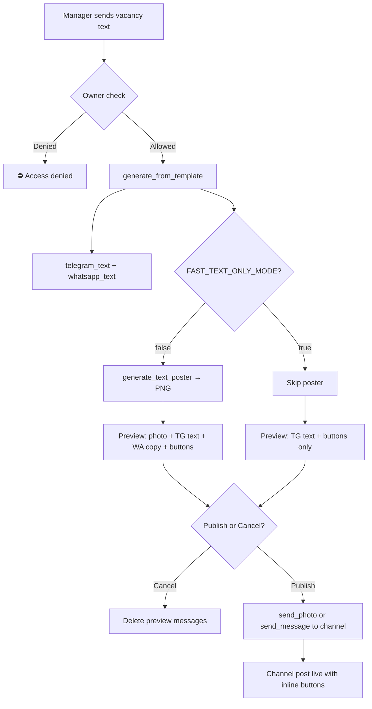
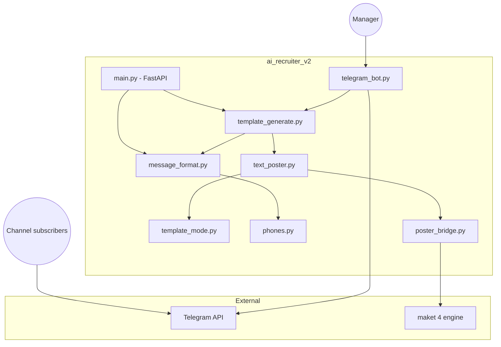
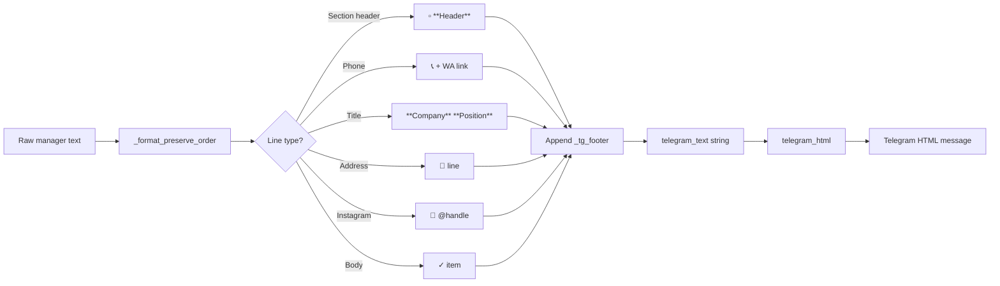
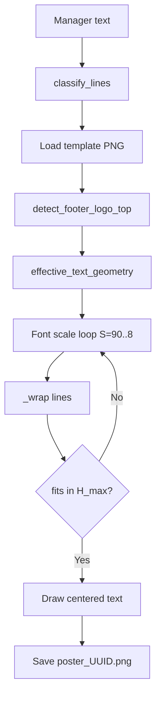
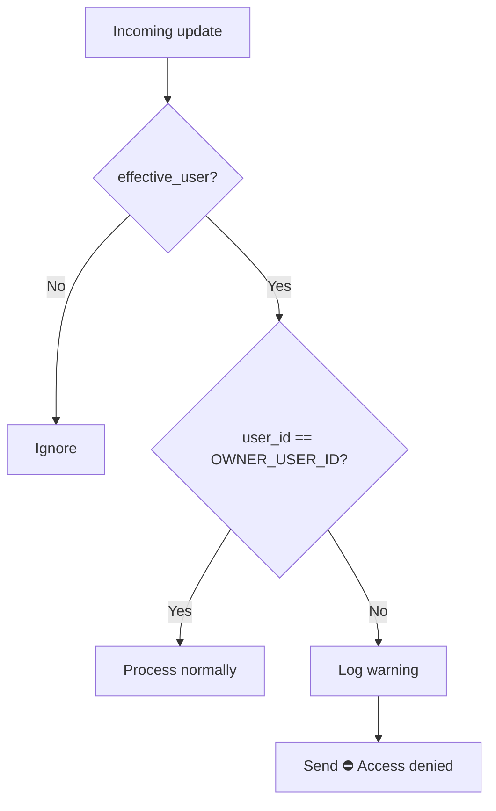
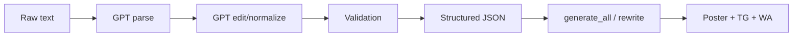

# PROJECT DOCUMENTATION — AI Recruiter v2 (Shymkent Rabota)

**Complete developer handover document**

| Item | Value |
|------|-------|
| Project root | `/Users/erg/Desktop/second ai/ai_recruiter_v2` |
| Manager Bot entry | `backend/telegram_bot.py` via `./run_bot.sh` |
| Public channel | `@Shymkent_Rabota_Job` |
| Poster engine (external) | `~/Desktop/maket 4/shymkent_poster_engine` |
| Production mode | Template mode — **no GPT** in live bot flow |
| Document version | June 2026 |

---

## Table of contents

1. [Project overview](#1-project-overview)
2. [Architecture](#2-architecture)
3. [Telegram Manager Bot](#3-telegram-manager-bot)
4. [Telegram formatting system](#4-telegram-formatting-system)
5. [Banner (poster) generation system](#5-banner-poster-generation-system)
6. [Publishing system](#6-publishing-system)
7. [Security](#7-security)
8. [Configuration](#8-configuration)
9. [Deployment](#9-deployment)
10. [Future improvements](#10-future-improvements)
11. [Flow diagrams](#11-flow-diagrams)
12. [Legacy GPT pipeline (web UI)](#12-legacy-gpt-pipeline-web-ui)
13. [Troubleshooting](#13-troubleshooting)

---

## 1. Project overview

### 1.1 What this bot does

The **Shymkent Rabota Manager Bot** is a private Telegram bot used by one authorized manager to:

1. Paste a **final, human-approved** vacancy text (Kazakh, Russian, or mixed).
2. Receive an instant **preview** of how the post will look on the public job channel.
3. **Publish** or **Cancel** with one tap.

The system **does not rewrite** vacancy content in production. It applies **formatting only**:

- Bold for company name, position names, section headers, salary/schedule values
- Section emojis (`▫️`, `✓`, `📞`, `📍`, `📱`)
- Clickable WhatsApp links on employer phone numbers
- Platform footer and inline buttons
- Optional PNG banner with the same text overlaid on a branded template

### 1.2 Full workflow



### 1.3 User journey

| Step | Actor | Action | System response |
|------|-------|--------|-----------------|
| 1 | Manager | `/start` | Instructions (varies by FAST mode) |
| 2 | Manager | Pastes vacancy text | "Generating…" (full mode only) |
| 3 | System | Generates outputs | Poster PNG (optional), formatted Telegram text, WhatsApp copy |
| 4 | System | Sends preview | Photo + "Telegram post preview" HTML message + WhatsApp plain text + Publish/Cancel |
| 5 | Manager | Reviews preview | Reads formatted post exactly as channel will receive it |
| 6a | Manager | **Publish** | Post goes to `@Shymkent_Rabota_Job` with platform buttons |
| 6b | Manager | **Cancel** | Preview messages deleted |
| 7 | Public | Sees channel post | Vacancy + 🔥 ВАКАНСИЯ ЖАРИЯЛАУ / Разместить своё объявление buttons |

---

## 2. Architecture

### 2.1 Folder structure

```
ai_recruiter_v2/
├── backend/                 # Python application
├── frontend/                # Static web UI (optional)
├── posters/
│   └── generated/           # PNG output (gitignored content, .gitkeep tracked)
├── samples/                 # Test vacancy JSON files
├── reports/                 # Batch test reports
├── scripts/                 # Batch pipeline scripts
├── .env                     # Secrets (NOT in git)
├── .env.example             # Template for .env
├── requirements.txt         # Python dependencies
├── run_bot.sh               # Start Manager Bot
├── run.sh                   # Start FastAPI web server
├── README.md                # Quick start
└── PROJECT_DOCUMENTATION.md # This file
```

### 2.2 Purpose of every folder

| Folder | Purpose |
|--------|---------|
| `backend/` | All business logic: bot, formatting, poster, legacy GPT API |
| `frontend/` | Browser UI for dev/testing (`index.html`, `app.js`, `styles.css`) |
| `posters/generated/` | Runtime output directory for PNG banners (`poster_<uuid>.png`) |
| `samples/` | Fixed test vacancies for batch parsing (`vacancies_20.json`, edge cases) |
| `reports/` | Markdown/JSON output from `scripts/run_pipeline_batch.py` |
| `scripts/` | CLI tools for batch GPT pipeline testing |
| `.venv/` | Python virtual environment (created by run scripts, not in git) |

### 2.3 Important files in `backend/`

#### Production (live bot path)

| File | Purpose |
|------|---------|
| `telegram_bot.py` | Manager Bot: handlers, preview, publish, owner security |
| `template_generate.py` | Orchestrator: text formatting + poster + FAST mode flag |
| `message_format.py` | **Core formatter** — Telegram HTML markers, WhatsApp text, buttons |
| `text_poster.py` | PIL renderer — text onto maket 4 template |
| `template_mode.py` | Line role classification for poster (hero/header/phone/body) |
| `phones.py` | Phone normalize (`87763837171`), display (`+7 776 383 71 71`) |
| `schema.py` | Pydantic models (`TemplateGenerateResponse`, `TelegramButton`, etc.) |
| `language.py` | Kazakh/Russian detection for section header language |

#### Poster bridge

| File | Purpose |
|------|---------|
| `poster_bridge.py` | Connects to external `maket 4` engine; legacy structured-data poster path |
| `poster_text_adapter.py` | Converts GPT `poster_text` to maket JSON (legacy) |
| `poster_sanitize.py` | Sanitizes poster preview JSON |

#### Legacy GPT pipeline (NOT used by Manager Bot)

| File | Purpose |
|------|---------|
| `main.py` | FastAPI server — `/api/parse`, `/api/normalize`, `/api/generate`, etc. |
| `parser.py` | GPT vacancy parsing |
| `editor.py` | GPT copy editing |
| `normalize.py` | Full normalize + review pipeline |
| `rewrite.py` | GPT rewrite to poster/TG/WA text |
| `generate.py` | Generate from structured JSON |
| `validation.py` | Phone/position/language validation |
| `reviewer.py` | GPT quality review |

---

## 3. Telegram Manager Bot

**File:** `backend/telegram_bot.py`  
**Start:** `./run_bot.sh`

### 3.1 How it receives vacancy text

- Handler: `on_text()` — `MessageHandler(filters.TEXT & ~filters.COMMAND, on_text)`
- Only processes text messages from `OWNER_USER_ID`
- Strips whitespace; rejects empty text
- Clears any previous pending preview for the same user

### 3.2 How parsing works (production)

**There is no GPT parsing in the live bot.**

"Parsing" in production means:

1. **Line-by-line walk** in `message_format._format_preserve_order()` — preserves original order
2. **Section detection** via `header_section_key()` — matches aliases like `Талаптар`, `Байланыс`, `Контакты`
3. **Phone extraction** via `_parse_phone_entry()` + `phones.process_phones()` / `normalize_phone_internal()`
4. **Poster line classification** via `template_mode.classify_lines()` — assigns visual roles only

The manager's text is never restructured into JSON in the bot flow.

### 3.3 How formatting works

```
Manager text
    → template_generate.generate_from_template()
        → message_format.telegram_text()      # Telegram body with **bold** and {{WA:url}} markers
        → message_format.whatsapp_text()      # Plain text, same order
        → message_format.build_telegram_buttons()
    → telegram_bot stores result in PendingPost
    → telegram_html() converts markers to Telegram HTML before send
```

See [§4 Telegram formatting system](#4-telegram-formatting-system) for rules.

### 3.4 How preview generation works

**Function chain:**

```
on_text()
  → asyncio.to_thread(generate_from_template, text)
  → PendingPost stored in context.application.bot_data["pending_posts"]
  → Messages sent (depends on FAST_TEXT_ONLY_MODE):
```

| FAST_TEXT_ONLY_MODE | Preview messages |
|---------------------|------------------|
| `false` (full) | 1. Poster photo 2. Telegram HTML preview 3. WhatsApp copy 4. Publish/Cancel |
| `true` (fast) | 1. Telegram HTML preview 2. Publish/Cancel |

**Telegram preview payload** (line 226–228):

```python
f"<b>Telegram post preview</b>\n\n{telegram_html(pending.telegram_preview_text)}"
parse_mode=ParseMode.HTML
```

**Timing logs** (console):

| Log | Event |
|-----|-------|
| `TIMING [1]` | Message received |
| `TIMING [2]` | Poster generation starts |
| `TIMING [3]` | Poster generation finishes |
| `TIMING [4]` | sendPhoto starts |
| `TIMING [5]` | sendPhoto finishes |
| `TIMING [6]` | Total processing time |

### 3.5 How publish works

**Handler:** `on_callback()` when `callback_data == "mgr_publish"`

1. Loads `PendingPost` from in-memory store (lost on bot restart)
2. Builds HTML: `telegram_html(pending.telegram_channel_text)`
3. Builds channel buttons: `channel_inline_keyboard(source_text)` → two WhatsApp URL buttons
4. Sends to `TELEGRAM_CHANNEL_ID`:
   - If `png_path` exists and FAST mode off: `send_photo` with caption (or split if caption > 1024 chars)
   - Else: `send_message` with HTML text + inline keyboard
5. Clears preview messages; edits action message to "Published ✓"

---

## 4. Telegram formatting system

**File:** `backend/message_format.py`  
**Design principle:** **Designer mode** — preserve original line order and wording exactly. Only formatting, emojis, bold, WhatsApp links, and platform footer are added.

### 4.1 Entry points

| Function | Output |
|----------|--------|
| `telegram_text(text)` | Telegram body with `**bold**` and `{{WA:https://wa.me/…}}` markers |
| `whatsapp_text(text)` | Plain text, same order, no HTML links |
| `telegram_html(text)` | Converts markers to Telegram HTML (`<b>`, `<a href>`) |
| `build_telegram_buttons(text)` | Platform inline button definitions |
| `channel_inline_keyboard(text)` | One button per row for channel publish |

### 4.2 Core algorithm: `_format_preserve_order()`

Walks each line of source text in order:

1. Skip empty lines (preserved as blank lines)
2. Skip service labels (`should_skip_line` — e.g. `vacancy titles:`)
3. Detect section headers → replace with formatted header (`▫️ **Талаптар**`)
4. Detect phone lines → `_tg_contact_line()` with WhatsApp link
5. First non-skipped content line → title formatting (`_format_title_line`)
6. Inside `instagram` section → `📱 @handle`
7. Inside `address` section → `📍 …`
8. Inside requirements/conditions/responsibilities → `✓ …` with optional value bolding
9. Position-like lines → `✓ **Position**`
10. Append platform footer via `_tg_footer()`

### 4.3 Bold rules

| Element | Bold? | Function |
|---------|-------|----------|
| Company name in title | Yes | `_format_title_line()` → `split_company_from_title()` |
| Position name in title | Yes | Before `қажет`/`керек`/etc. |
| Section header labels | Yes | `_tg_section_header()` → `▫️ **Талаптар**` |
| Requirement/condition bullets | No (text unchanged) | `_body_line()` |
| Salary value after label | Yes | `_highlight_key_values()` |
| Schedule value after `График:` | Yes | `_highlight_key_values()` |
| Work hours value | Yes | `_highlight_key_values()` |
| Phone numbers | No | Plain in `📞` line |
| Address text | No | |
| Instagram handle | No | |

### 4.4 Section detection rules

**Function:** `header_section_key(line)` in `message_format.py`

Normalizes line (lowercase, strip `:`) and matches against `SECTION_ALIASES`:

| Section key | Kazakh aliases | Russian aliases |
|-------------|--------------|-----------------|
| `requirements` | талаптар | требования |
| `responsibilities` | міндеттері, миндеттері | обязанности |
| `conditions` | шарттары, жалақы, … | условия, зарплата, … |
| `contacts` | байланыс | контакты, телефон |
| `address` | мекенжай | адрес |
| `instagram` | instagram, insta | instagram |

**Language for headers:** `detect_post_language()` — counts Kazakh vs Russian markers in full text; picks one language for all headers (no mixing).

**Telegram header marker:** `▫️` (via `TG_SECTION_MARKER`)  
**WhatsApp header marker:** `◽️` (via `SECTION_MARKER` in `_wa_section_header`)

### 4.5 Emoji rules

| Context | Emoji |
|---------|-------|
| Telegram section header | `▫️` |
| Requirement/condition item | `✓` |
| Phone contact | `📞` |
| WhatsApp link label | `💬 WhatsApp` |
| Address | `📍` |
| Instagram (Telegram) | `📱 @username` |
| Instagram (WhatsApp) | `📸 username` |
| Platform footer promo | `🔥` |

### 4.6 WhatsApp link logic (employer phones)

**Contact line builder:** `_tg_contact_line(entry, multiple, include_wa_links=True)`

Output format:
```
📞 +7 778 381 33 82 | {{WA:https://wa.me/77783813382}}
```

**HTML conversion:** `_render_telegram_line()` replaces `{{WA:url}}` with:
```html
<a href="https://wa.me/77783813382">💬 WhatsApp</a>
```

**Phone parsing:** `_parse_phone_entry(line)`

1. Strips labels: `Номер:`, `Телефон:`, `WhatsApp:`, etc.
2. Tries `phones.process_phones()`
3. Fallback: `normalize_phone_internal()` for odd spacing (e.g. `8775 085 85 28`)
4. If parsing fails → line passed through **unchanged** (no WhatsApp link)

**URL builder:** `_wa_me_url(display)` → `https://wa.me/7XXXXXXXXXX`

**Important:** Platform footer phone (`+7 776 383 7171`) has **no** WhatsApp link in the body — only plain `📞`. Platform WhatsApp is via **inline buttons** only.

### 4.7 Instagram logic

Inside `instagram` section after header:

- **Telegram:** `_tg_instagram_line()` → `📱 @handle` (adds `@` if missing)
- **WhatsApp:** `📸 handle` (no `@` requirement)

### 4.8 Footer logic

**Telegram footer** — `_tg_footer()`:
```
🔥 Өз хабарландыруыңызды орналастыру

📞 +7 776 383 7171
```

**WhatsApp footer** — `_wa_footer()`: same structure, plain text.

**Platform inline buttons** (channel only):
```
🔥 ВАКАНСИЯ ЖАРИЯЛАУ  → https://wa.me/77763837171
Разместить своё объявление → https://wa.me/77763837171
```

Defined in `PLATFORM_BUTTONS` constant.

### 4.9 Lines explicitly skipped

- Bare phone labels without digits: `Номер:`, `Телефон:` (`_is_phone_label_only`)
- Service labels: `vacancy titles:`, `poster text:`, etc.
- `📌 АШЫҚ ВАKANSИЯЛАР`-type headers (via `should_skip_line` / vacancies section key)

---

## 5. Banner (poster) generation system

**Files:** `backend/text_poster.py`, `backend/template_mode.py`, `backend/poster_bridge.py`  
**External engine:** `~/Desktop/maket 4/shymkent_poster_engine/`

### 5.1 Overview

The poster is **not** a designed layout from scratch. It is the **manager's exact text** rendered onto a fixed PNG template (maket 4) with:

- Red text `#ED1C24`
- Centered horizontal alignment
- Automatic font scaling to fit
- Word wrapping within template bounds

**No content changes** — same words, same order as source.

### 5.2 Template detection

**Function:** `poster_bridge._template_path()`

1. If `MAKET4_TEMPLATE` env set → use that file path
2. Else → `{MAKET4_ROOT}/AC1665E4-6875-4288-81DF-0CCAFCDD4A94.PNG`
3. Default `MAKET4_ROOT` = `~/Desktop/maket 4`

**Engine bootstrap:** `poster_bridge._ensure_engine()` adds maket folder to `sys.path` and imports `shymkent_poster_engine`.

### 5.3 Line classification (template_mode.py)

**Function:** `classify_lines(text)` → list of `(line_text, role)`

| Role | Meaning | Font scale (×S) |
|------|---------|-----------------|
| `hero` | Lines before first section header | 1.00 |
| `section_header` | Known section names | 0.62 |
| `phone` | Phone number lines | 0.72 |
| `body` | Everything else in sections | 0.48 |
| `blank` | Empty lines | 0 |

Classification uses `SECTION_HEADERS` set and `is_phone_line()` — independent from Telegram formatter section aliases (similar but separate).

### 5.4 Text positioning

**Function:** `text_poster._layout(blocks, geo)`

1. Calculate total stack height of all blocks
2. Vertically center stack in active text area: `geo.active_top + (geo.A_h - h) / 2`
3. Each block gets `y` coordinate; horizontal center: `cx = geo.C_x`
4. Each wrapped sub-line drawn at `(cx - width/2, y)`

**Geometry source:** `text_poster._resolve_geo(template_path)`

```python
base = Geometry.from_canvas(width, height)
logo_top = detect_footer_logo_top(img, base)
geo = effective_text_geometry(base, logo_top)
```

Returns: `active_top`, `A_h` (available height), `H_max`, `W_max`, `C_x`.

### 5.5 Font scaling

**Loop:** `text_poster.generate_text_poster()` lines 185–193

```
S = 90, 88, 86, … 8  (step 2)
For each S:
  build blocks at scale S
  if stack_height <= geo.H_max → use this S
```

- `MIN_S = 8.0`, `MAX_S = 90.0`
- If text still overflows at MIN_S → warning + truncate blocks below `max_y`

**Font file:** resolved via `shymkent_poster_engine.engine._resolve_font()`

### 5.6 Line wrapping

**Function:** `text_poster._wrap(text, font, max_width)`

1. Word-wrap on spaces
2. Character-wrap long tokens that exceed `max_width`
3. `max_width = geo.W_max` from template geometry

### 5.7 Logo / footer detection

**Function:** `shymkent_poster_engine.template_analysis.detect_footer_logo_top(img, base)`

- Scans template PNG pixels to find footer logo region
- ~180 ms per poster (performance bottleneck)
- Sets upper bound of text area so text does not overlap channel branding at bottom

This runs on **every** poster generation (not cached in current code).

### 5.8 Image export

**Function:** `generate_text_poster()` final steps

1. `ImageDraw.Draw(canvas)` on RGBA template copy
2. Draw each text line in red
3. Save to `posters/generated/poster_{uuid12}.png` as PNG
4. Typical file size: **~1.6 MB** (uncompressed — upload bottleneck)

**Return:** `(png_path, warning_message, debug_lines)`

### 5.9 FAST_TEXT_ONLY_MODE bypass

When `FAST_TEXT_ONLY_MODE=true` in `.env`, `template_generate.generate_from_template()` skips `generate_text_poster()` entirely. Poster files are not created; preview uses text only.

---

## 6. Publishing system

### 6.1 Preview stage

**In-memory state:** `PendingPost` dataclass stored in `context.application.bot_data["pending_posts"][user_id]`

| Field | Content |
|-------|---------|
| `source_text` | Original manager input |
| `telegram_preview_text` | Formatted Telegram body |
| `telegram_channel_text` | Same as preview (channel uses identical text) |
| `whatsapp_text` | Plain WhatsApp copy |
| `channel_buttons` | Platform button definitions |
| `png_path` | Path to generated PNG or `None` |
| `preview_message_ids` | Message IDs to delete on cancel/publish |

### 6.2 Publish button

- Label: **"Publish to Telegram"**
- Callback: `mgr_publish`
- Handler: `on_callback()` in `telegram_bot.py`
- Sends to `TELEGRAM_CHANNEL_ID` with HTML formatting + inline keyboard

**Caption length:** Telegram limit 1024 chars for photo captions. If exceeded, sends photo without caption + separate text message.

### 6.3 Cancel button

- Label: **"Cancel"**
- Callback: `mgr_cancel`
- Deletes all preview messages; removes pending post from store
- Also available via `/cancel` command

### 6.4 Channel publishing

**Full mode** (`png_path` exists, FAST off):

```
send_photo(channel, photo, caption=html, reply_markup=buttons)
```

**Text-only** (FAST mode or no poster):

```
send_message(channel, text=html, parse_mode=HTML, reply_markup=buttons)
```

Channel post includes same formatted text as preview + two platform WhatsApp buttons at bottom.

---

## 7. Security

### 7.1 OWNER_USER_ID logic

**File:** `telegram_bot.py`

```python
def _owner_user_id() -> int:
    raw = os.environ.get("OWNER_USER_ID")
    return int(raw)  # Required — bot won't start without it

def _is_owner(user_id: int) -> bool:
    return user_id == _owner_user_id()
```

### 7.2 Single-user protection

**Function:** `_guard_owner(update, source=...)`

Called at start of every handler:

- `start`, `cancel_cmd`, `on_text`, `on_callback`
- `on_other_message`, `on_other_command` (non-owners only)

Non-owners receive: `⛔ Access denied`

Unauthorized attempts logged:
```
WARNING: Unauthorized access attempt: user_id=… username=… source=…
```

### 7.3 Access restrictions

| Resource | Restriction |
|----------|-------------|
| Manager Bot commands | Owner only |
| Vacancy text input | Owner only |
| Publish/Cancel callbacks | Owner only |
| Photos/documents to bot | Ignored (owner); denied (others) |
| Public channel | Anyone can read; only bot posts |

### 7.4 Multi-device support

Telegram `user_id` is account-level. Same owner on iPhone, iPad, and MacBook shares one `OWNER_USER_ID`.

---

## 8. Configuration

**File:** `.env` (copy from `.env.example`)

| Variable | Required | Default | Description |
|----------|----------|---------|-------------|
| `TELEGRAM_BOT_TOKEN` | **Yes** (bot) | — | BotFather token for Manager Bot |
| `TELEGRAM_CHANNEL_ID` | **Yes** (bot) | — | Target channel, e.g. `@Shymkent_Rabota_Job` |
| `OWNER_USER_ID` | **Yes** (bot) | — | Manager's numeric Telegram user ID |
| `FAST_TEXT_ONLY_MODE` | No | `true` in example | `false` = poster + photo; `true` = text-only fast preview |
| `MAKET4_ROOT` | No | `~/Desktop/maket 4` | Path to poster engine folder |
| `MAKET4_TEMPLATE` | No | `AC1665E4-….PNG` in maket root | Override template PNG path |
| `OPENAI_API_KEY` | For web/GPT only | — | Not used by Manager Bot |
| `OPENAI_MODEL` | No | `gpt-4o-mini` | GPT model for legacy API |
| `PORT` | No | `8790` | Web UI port (`run.sh`) |

**Loading:** `load_dotenv(ROOT / ".env")` in `telegram_bot.py`, `main.py`, and via `run_bot.sh` / `run.sh` shell export.

---

## 9. Deployment

### 9.1 How to run the bot

```bash
cd "/Users/erg/Desktop/second ai/ai_recruiter_v2"
cp .env.example .env
# Edit .env

chmod +x run_bot.sh
./run_bot.sh
```

`run_bot.sh` will:

1. Create `.venv` if missing
2. `pip install -r requirements.txt`
3. Source `.env`
4. `exec python backend/telegram_bot.py`

### 9.2 How to restart

```bash
pkill -f "telegram_bot.py" 2>/dev/null || true
sleep 2
cd "/Users/erg/Desktop/second ai/ai_recruiter_v2"
./run_bot.sh
```

Verify only **one** bot process:
```bash
pgrep -fl "telegram_bot.py"
```

Expected log:
```
Manager bot started — channel @Shymkent_Rabota_Job owner 766962597 fast_text_only=False
Application started
```

### 9.3 How to move to another computer

1. Copy entire `ai_recruiter_v2/` folder
2. Copy `~/Desktop/maket 4/` folder (poster engine — separate)
3. Copy `.env` (or recreate from `.env.example`)
4. Install Python 3.9+
5. Run `./run_bot.sh` (creates new `.venv`)
6. Ensure `MAKET4_ROOT` points to maket 4 on new machine
7. Bot token and channel ID unchanged unless creating new bot

### 9.4 How to backup

**Critical (must backup):**

| Item | Why |
|------|-----|
| `.env` | Tokens, owner ID, channel |
| `backend/message_format.py` | All formatting rules |
| `backend/telegram_bot.py` | Bot behavior |
| `~/Desktop/maket 4/` | Template PNG + geometry engine |

**Optional:**

| Item | Why |
|------|-----|
| `posters/generated/` | Regenerated each post |
| `.venv/` | Recreated by run script |
| Legacy GPT modules | In git / folder copy |

**Not in git:** `.env` is gitignored — backup manually.

---

## 10. Future improvements

### 10.1 Recommended optimizations (performance)

| Priority | Change | Expected gain |
|----------|--------|---------------|
| High | PNG compression (`optimize=True` or JPEG) | 60–80% faster upload |
| High | Cache `detect_footer_logo_top()` result | ~180 ms per poster |
| High | `asyncio.to_thread()` for generation (already in bot) | Prevents event loop freeze |
| Medium | Binary search font scale (not linear 90→8) | ~80 ms per poster |
| Medium | Combine preview into fewer Telegram messages | ~500 ms per preview |
| Medium | Increase `media_write_timeout` for large PNGs | Prevents timeout errors |
| Low | Pre-warm poster engine on bot startup | Removes first-call latency |

**Observed timings (typical vacancy):**

| Step | Time |
|------|------|
| Text formatting | < 1 ms |
| Poster generation | ~400 ms |
| Telegram photo upload | ~1.8 s |
| Full preview | ~3–4 s |

### 10.2 Scalability ideas

- Run bot as systemd service / launchd plist for auto-restart
- Persist `PendingPost` to Redis/SQLite (survives bot restart)
- Separate poster worker queue (Celery/RQ) for async PNG generation
- Webhook mode instead of polling for faster response at scale
- Admin web dashboard for vacancy history
- Multi-manager support with role-based `OWNER_USER_ID` list (currently single owner)

### 10.3 Code quality

- Remove unused legacy `parse_vacancy_layout()` path in `message_format.py`
- Unify phone extraction regex in `phones.py` for spaced numbers (`8775 085 85 28`)
- Add integration tests for formatter edge cases
- Single source for section header aliases (`template_mode` vs `message_format`)

---

## 11. Flow diagrams

### 11.1 Complete system architecture



### 11.2 Formatting pipeline



### 11.3 Poster generation pipeline



### 11.4 Security check flow



---

## 12. Legacy GPT pipeline (web UI)

**Not used by Manager Bot.** Available via `./run.sh` → `http://localhost:8790`



**Endpoints:**

| Endpoint | Purpose |
|----------|---------|
| `POST /api/generate` | Template mode (same as bot — no GPT) |
| `POST /api/parse` | GPT → structured JSON |
| `POST /api/normalize` | Full normalize pipeline |
| `POST /api/rewrite` | GPT rewrite all outputs |
| `POST /api/generate-all` | From approved JSON |

---

## 13. Troubleshooting

### WhatsApp link missing in preview

1. Confirm you are reading **"Telegram post preview"** message, not the WhatsApp copy message below it (plain text, no links by design).
2. Check phone format — 10-digit partial numbers fail parsing; line stays as raw `Номер: …`.
3. Footer phone has no WA link in body — only employer contact lines and channel buttons.

### Bot slow / freezes

1. Check `FAST_TEXT_ONLY_MODE` — set `true` for 1–2 s response.
2. Poster upload (~1.6 MB) is the main delay in full mode.
3. Ensure only one `telegram_bot.py` process running.

### Poster generation fails

```
Poster engine not found at ~/Desktop/maket 4
```

Set `MAKET4_ROOT` in `.env` to correct path.

### Publish fails with timeout

```
httpx.WriteTimeout on sendPhoto
```

Network/upload issue with large PNG. Use FAST mode or compress PNG (future fix).

### Access denied

Verify `OWNER_USER_ID` in `.env` matches your Telegram user ID from @userinfobot.

---

## Appendix A — Function reference (production path)

| Step | File | Function |
|------|------|----------|
| Receive message | `telegram_bot.py` | `on_text()` |
| Generate outputs | `template_generate.py` | `generate_from_template()` |
| Format Telegram | `message_format.py` | `telegram_text()` |
| Format WhatsApp | `message_format.py` | `whatsapp_text()` |
| Build contact line | `message_format.py` | `_tg_contact_line()` |
| Parse phone | `message_format.py` | `_parse_phone_entry()` |
| HTML conversion | `message_format.py` | `telegram_html()` |
| Generate poster | `text_poster.py` | `generate_text_poster()` |
| Classify lines | `template_mode.py` | `classify_lines()` |
| Template path | `poster_bridge.py` | `_template_path()` |
| Publish | `telegram_bot.py` | `on_callback()` |
| Owner check | `telegram_bot.py` | `_guard_owner()` |

---

## Appendix B — Example formatted output

**Input:**
```
Megadom Opt дүкеніне сатушы қажет

Байланыс:
87783813382

Мекенжай:
Арғынбеков 54

Instagram:
megadom.opt
```

**Telegram output (HTML):**
```
Megadom Opt дүкеніне сатушы қажет

▫️ Байланыс
📞 +7 778 381 33 82 | 💬 WhatsApp

▫️ Мекенжай
📍 Арғынбеков 54

▫️ Instagram
📱 @megadom.opt

🔥 Өз хабарландыруыңызды орналастыру

📞 +7 776 383 7171
```

---

*End of PROJECT_DOCUMENTATION.md*
